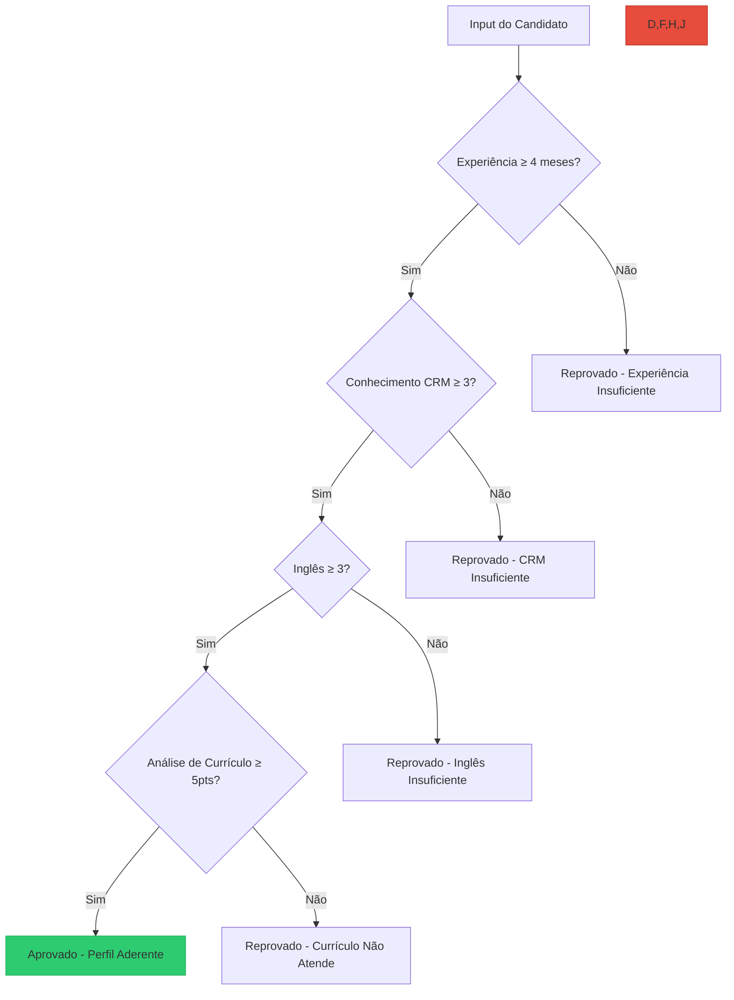

# TalentScope CS – Analisador Inteligente para Estágio em Customer Success

## Visão Geral

O **TalentScope CS** é uma plataforma de inteligência artificial voltada para a **seleção inteligente de candidatos a estágio em Customer Success**, utilizando análise automatizada de currículos, pontuação por critérios definidos e recomendações para desenvolvimento profissional.

### Principais Funcionalidades:

✅ Pontuação automatizada com base em experiência, inglês, CRM e currículo  
📊 Avaliação de competências técnicas e comportamentais  
🔍 Detecção de palavras-chave relevantes em currículos  
💡 Recomendações personalizadas para melhoria do perfil  

🔗 **Acesse o projeto:** [Hugging Face Space](https://huggingface.co/spaces/Crislene/TalentScopeCS)

---

## Modelo de Classificação Utilizado

Para classificar se um(a) candidato(a) é **aderente** à vaga de estágio em Customer Success, foi utilizado um modelo de **Árvore de Decisão** do `scikit-learn`, com os seguintes parâmetros configurados:

```python
DecisionTreeClassifier(
    max_depth=4,
    min_samples_split=5,
    class_weight='balanced',
    random_state=42
)
```

### Variáveis Utilizadas no Treinamento

As variáveis de entrada (features) escolhidas foram:

- `tempo_experiencia` — Tempo de experiência prévia (em meses)
- `conhecimento_crm` — Nível de conhecimento em CRM (escala de 1 a 5)
- `ingles` — Nível de proficiência em inglês (escala de 1 a 5)
- `graduacao` — Status da graduação (Cursando = 1, Completo = 0)

A variável alvo (target) é `aderente`, que indica se a pessoa atende ou não aos critérios para a vaga.

### Ajustes Específicos

- O modelo foi treinado com balanceamento de classes via `class_weight='balanced'` para compensar a proporção desigual entre candidatos aderentes e não aderentes.
- Foi aplicado um bônus de até **30% na probabilidade final** com base na análise de palavras-chave do currículo enviado (via PDF ou texto), melhorando a capacidade do modelo de considerar soft skills e experiências descritas.

### Avaliação do Modelo

O modelo foi avaliado com os seguintes recursos:

- **Matriz de Confusão**
- **Relatório de Classificação** (`precision`, `recall`, `f1-score`)
- **Gráfico de Importância das Features**

Essas métricas permitem validar a performance preditiva e a interpretabilidade do modelo.

---


## Fluxograma da Lógica de Aprovação



---

## 🔧 Arquitetura Técnica

| Componente            | Tecnologia         | Descrição                                 |
|-----------------------|--------------------|--------------------------------------------|
| Backend de Análise    | Python 3.10         | Lógica principal de classificação           |
| Modelo de ML          | Scikit-learn        | Árvore de decisão com `max_depth=4`        |
| Interface Web         | Gradio              | Interface interativa no navegador          |
| NLP                   | Regex + análise léxica | Extração de palavras-chave de currículos |
| Deploy                | Hugging Face Spaces | Publicação automática e acessível online   |

---

## 📈 Métricas do Modelo

```python
              precision    recall  f1-score   support

           0       0.85      0.89      0.87        28
           1       0.86      0.82      0.84        22

    accuracy                           0.86        50
   macro avg       0.86      0.85      0.85        50
weighted avg       0.86      0.86      0.86        50
```

---

## Como Executar

### Pré-requisitos

```bash
Python 3.10+
pip install -r requirements.txt
```

### Instalação

```bash
git clone https://github.com/seu_usuario/TalentScopeCS.git
cd TalentScopeCS
pip install -r requirements.txt
```

### Execução Local

```bash
python app.py
```

---

## Estrutura de Arquivos

```
TalentScopeCS/
├── app.py                        # Código principal da aplicação
├── requisitos.txt                # Dependências do projeto
├── modelo_treinado.joblib        # Modelo de ML treinado
└── README.md                     # Este arquivo 
```

---

## 🌟 Destaques Técnicos

### 1. Análise de Currículo com NLP Básico

```python
def analisar_curriculo(texto):
    score = 0
    for palavra in palavras_chave:
        if palavra in texto.lower():
            score += 1
    return min(score, 10)
```

---

### 2. Sistema de Pontuação Ponderada

```python
pontuacao = (
    experiencia * 0.30 +
    crm * 0.25 +
    ingles * 0.20 +
    curriculo_score * 0.25
)
```

---

### 3. Exemplo de Cálculo

```python
candidato = {
    "experiencia": 5,
    "crm": 4,
    "ingles": 3,
    "curriculo_score": 6.2
}

pontuacao_final = (5*0.30) + (4*0.25) + (3*0.20) + (6.2*0.25)
# Resultado: 73.5 (⚠️ Potencial)
```

---

## 📚 Metodologia

- **Geração de Dados:**  
  200 candidatos simulados com diferentes perfis.

- **Engenharia de Features:**  
  Conversão de experiência, inglês, CRM e análise textual.

- **Treinamento:**  
  Árvore de Decisão balanceada e validada com holdout de 50 candidatos.

---

## 📊 Critérios de Aprovação

| Status         | Pontuação | Requisitos                                   |
|----------------|-----------|----------------------------------------------|
| ✅ Aprovado     | ≥ 75      | Cumpre todos os critérios mínimos            |
| ⚠️ Potencial    | 50–74     | Perfil promissor, com necessidade de ajustes |
| ❌ Reprovado    | < 50      | Não atende os requisitos essenciais          |

---

## 🤝 Como Contribuir

1. Faça um fork do projeto  
2. Crie uma nova branch `git checkout -b feature/nova-feature`  
3. Commit suas alterações `git commit -m 'Nova feature'`  
4. Push `git push origin feature/nova-feature`  
5. Crie um Pull Request 🎉

---

## 📄 Licença

Distribuído sob a licença MIT. Veja `LICENSE` para mais informações.

---

<div align="center">  
  <p>Desenvolvido com ❤️ por <a href="https://github.com/crislenenunes">Crislene Nunes</a> duarnte o Bootcamp de IA LLM da SoulCode</p>  
    
    
    
</div>

---


